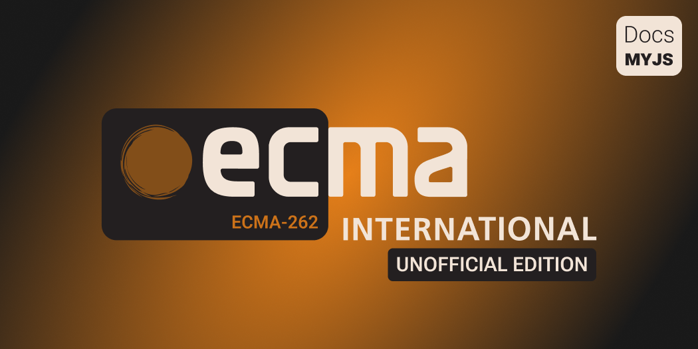

<div align='center'>
    
</div>

<br>

<hgroup>
    <h1 align='center'>— MyJS Web Docs —</h1>
    <p align='center'>Первое приближение к общему пониманию ECMAScript Language Specification.</p>
</hgroup>

[MyJS Web Docs](https://github.com/denlove/myJS) — это _неофициальная авторская документацая_ в
формате непринуждённого разговора с читателем, представляющая из себя набор сгруппированных по
главам тем, мыслей, фактов, выводов и собственных мнений относительно того, чем для меня является
спецификация ECMAScript, как для разработчика на языке JavaScript. Я попытался проникнуться
содержанием данной спецификации и в помощь всем остальным, кто тоже захочет её постичь, решил
написать данный документ, отражающий моё видение тех вещей, которые находятся непосредственно в зоне
ответственности официального
[стандарта ECMA-262](https://ecma-international.org/publications-and-standards/standards/ecma-262/).
Документация вынесена на суд общественности и комьюнити разработчиков в полном объёме. Активные
споры и конструктивные предложения приветствуются.

<br>

## 🗂️ Содержание

> [!WARNING]  
> **_Продукт находится на этапе beta-разработки!_**  
> В ближайшем будущем он будет преобразован в полноценное веб-приложение.

> [!NOTE]  
> По мере возможности данная документация постепенно будет дополняться и редактироваться согласно
> новым версиям спецификации ECMAScript и появлению мнений и оценок со стороны читающих её людей,
> которые захотят поделиться своими мыслями и сделать свой вклад в этот продукт.

#

Здесь представлено полное доступное содержание документации:

-   Глава 0: [Важное предисловие](/Preface.md)
-   Глава 1: [Методология исследования](/Methodology.md)
-   Глава 2: [Введение](/Introduction.md)
-   Глава 3.0: ["Начало" языка](get-started/index.md)
    -   Глава 3.1: [Грамматика языка спецификации](get-started/Chapter_1.md)
    -   Глава 3.2: [Типы языка спецификации](get-started/Chapter_2.md) ✏️
    -   Глава 3.3: [Алгоритмы или "опять ReturnIfAbrupt"](get-started/Chapter_3.md) ✏️
-   Глава 4.0 [Операции](operations/index.md) ✏️

<br>

## 🍰 Мотивация

В жизни каждого разработчика возникает момент, когда он сталкивается с задачами, где **_вопрос
оптимизации_** крайне важен. А когда синтаксис языка и его паттерны уже изучены и отработаны на
практике, хочется понять, как он работает "_под капотом_". Понимание спецификации языка ECMAScript -
огромный шаг на пути к написанию высокооптимизированного кода. Задача документации - углубиться в
недра спецификации и показать, из чего она состоит, как её читать и как устроены основные алгоритмы
языка. В этом нам поможет, к сожалению, единственный официальный источник -
[ECMAScript Language Specification](https://tc39.es/ecma262/multipage/).

Как известно, **_JavaScript - язык сверхвысоких абстракций_**, и его спецификация написана в том же
духе. Поэтому документация призвана, в том числе помочь совместно с рассказчиком разобраться в
дебрях и абсолютных неочевидностях, встречающихся повсеместно. Например, оказывается, что строка
кода ниже на языке JavaScript _не имеет ничего общего с переменными, присваиванием и примитивами_.
**_Вместо этого поверх вышесказанного язык вводит свои термины и абстракции, с которыми позволяет
нам работать._**

```javascript
var str = 'hello'; // соотнесём идентификатор str со строкой 'hello'
```

Для написания качественного кода знаний одной лишь спецификации недостаточно! Немаловажным будет
изучить и работу оптимизирующего движка, например, [V8](https://v8.dev/blog) - самый успешный
JavaScript движок современности.

<br>

## 🚀 Внесли серьёзный вклад

Здесь представлены люди, которые немало поработали над тем, чтобы документация вышла в свет и в
будущем становилась только лучше по мере выхода новых глав, исправлений и дополнений. Этот список
будет пополняться в зависимости от вкладов в проект.

<div>
    <a href='https://github.com/denlove'>
        
    </a>
</div>
<br>

Информация собрана при поддержке таких проектов, как:

<div align='left'>
    
    
    
    
    
</div>

<br>

## 🎓 Лицензия и Авторское право

На документацию распространяется лицензия:
[CC BY-NC-ND 4.0](https://creativecommons.org/licenses/by-nc-nd/4.0/)
