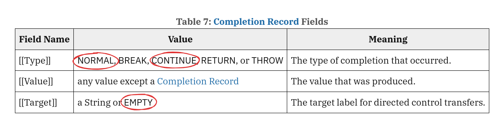

    
    
    &nbsp;&nbsp;
    <b>? min</b>

# Глава 3.3: Типы языка спецификации

> [!TIP]  
> Глава находится в разработке

Когда основные грамматические правила языка спецификации нам стали известны, стоит обратить внимание
на то, что и как они описывают. Если мы хотим правильно понять спецификацию, на данном этапе
справедливым будет задать вопрос: что помогает грамматике языка спецификации более точно и детально
описывать внутреннюю машинерию языка _ECMAScript_? При чём тут типы языка спецификации, как они
связаны с грамматикой и как реализованы на страницах стандарта? Это мы и разберём в нашей главе.

## Теория типов данных

Для начала хочется определить, с чем мы имеем дело, когда говорим о чём-то, что имеет какой-то тип.
Попробуем понять, а какую роль вообще в программировании имеют типы и для чего они нужны, как
реализованы.

> In computer science and computer programming, a data **_type_** (or simply type) is a
> **_collection_** or grouping of **_data values_**, usually specified by a set of **_possible
> values_**, a set of allowed **_operations_** on these values, and/or a **_representation_** of
> these values as machine types. A data type specification in a program constrains the possible
> values that an **_expression_**, such as a variable or a function call, **_might take_**.
>
> ~ [wiki](https://en.wikipedia.org/wiki/Data_type)

Очевидно, типы в языках программирования помогают разработчкам описывать значения (данные), с
которыми они вынуждены работать на своём поприще. Особенно важно, что типы существуют не только для
удобства разработчика при создании им некоторого продукта, но и для гарантирования в самом языке
выполнения правил, регулирующих поведение типов данных.

В контексте условного _общего программирования_ не стоит воспринимать типы только лишь относительно
так называемых _втроенных примитивов_
([**_built-in primitive data type_**](https://en.wikipedia.org/wiki/Primitive_data_type)). В разных
языках существуют конструкции, определение которых требует сопоставления нескольких встроенных
типов - _композитный тип данных_
([**_сomposite data type_**](https://en.wikipedia.org/wiki/Composite_data_type)).

И вообще, типы данных могут быть просто вспомогательной иллюзией, например, как в _TypeScript_,
который впоследствии компилируется в _JavaScript_, где указания таких типов и интерфейсов попросту
нет, а сами типы проверяются ещё на этапе написания программы, до его компиляции, но это уже больше
прерогатива современных редакторов кода.

Ну и стоит помнить, что есть типы, лишь _косвенно_ связанные с языком, например, **_типы языков
спецификации_.** Зачастую, с точки зрения грамматики самого языка, они являются вспомогательными, но
для правильной работы языка в какой-то системе, например, в _хост-среде_
([_host environment_](https://tc39.es/ecma262/multipage/overview.html#host-environment)), без таких
типов не обойтись. Но не у каждого языка спецификации есть свои типы, ровно как и не у каждой
спецификации есть её язык.

## Про типы в _ECMAScript_

В спецификации существует разделение типов на две системы[^1]:
[система типов языка _ECMAScript_](https://tc39.es/ecma262/multipage/ecmascript-data-types-and-values.html#sec-ecmascript-language-types)
и
[типов языка спецификации](https://tc39.es/ecma262/multipage/ecmascript-data-types-and-values.html#sec-ecmascript-specification-types).
Получилось это так, потому что грамматика языка спецификации в совокупности с цепочками алгоритмов
порождает необходимость подробного указания, с какими данными или сущностями работает тот или иной
алгоритм в рамках своей отдельной грамматики. Иначе благодаря избыточной сложности большинства
[алгоритмов](https://tc39.es/ecma262/multipage/notational-conventions.html#sec-algorithm-conventions)
они не получили бы точного описания, что повлекло бы за собой ещё большее усложнение.

Итак, на уровне внутренних алгоритмов языка _ECMAScript_ мы вынуждены работать как с одной системой
типов, так и с другой. Проблема в том, что они **_пересекаются_** на уровне стандарта, поэтому в них
можно легко запутаться. Вполне вероятно, что одна
[абстрактная операция](https://tc39.es/ecma262/multipage/abstract-operations.html#sec-abstract-operations)
может вернуть в качестве результата нечто, соответствующее типу языка _ECMAScript_, другая - вернёт
сущность, принадлежащую типу языка спецификации, хотя внутри самой операции алгоритмы будут
оперировать обеими системами типов.

Глава нацелена на развитие умения дифференциировать обе системы типов на уровне алгоритмов языка без
тесного контакта с самими [алгоритмами](/get-started/Chapter_3.md) (_следующая глава_). Мы подробно
разберём **_только систему типов языка спецификации_**, а другую - уже в соответствующей главе про
сам язык _ECMAScript_.

## Типы спецификации

Начнём разговор более предметно. Типы языка спецификации _ECMAScript_, согласно стандарту,
представляют из себя
[метаинформацию](https://tc39.es/ecma262/multipage/ecmascript-data-types-and-values.html#sec-ecmascript-specification-types)
внутри каждого отдельного алгоритма, которая призвана описывать семантику конструкций языка
_ECMAScript_ и даже его типы.

### Значение

У типов спецификации есть свои значения, по которым их можно отличать. Важно отметить, что, согласно
спецификации, значения таких типов являются **_артефактами спецификации_** и не обязаны
соответствовать чему-либо внутри самого языка _ECMAScript_.

Вдобавок ко всему сказанному значения типов могут описывать только промежуточные результаты
_операции оценки_
([_Evaluation_](https://tc39.es/ecma262/multipage/syntax-directed-operations.html#sec-evaluation)),
и не могут хранить свои значения в сущностях языка _ECMAScript_, например, в _свойствах_
([_property_](https://tc39.es/ecma262/multipage/overview.html#sec-property)) _объектов_. То есть, по
сути, типы спецификации - это вообще отдельные от языка _ECMAScript_ сущности,
инкапсулированно-имплементированные в отдельную систему типов, помогающую при описании языка и
принимающую участие в работе _host environment_.

### Виды

Давайте детально рассмотрим доступные на сегодняшний день типы спецификации. В ней во многих её
местах описание типов имеет интересное выражение - _"for notational convenience"_. Скорее всего, это
подразумевает определённый принцип написания, при котором редакторы попытались упростить типы для в
пользу их восприятия.

Получилось у них или нет, но на страницах стандарта нам явно представлено немало разных типов:

#### 1. [Enum Type](https://tc39.es/ecma262/multipage/ecmascript-data-types-and-values.html#sec-enum-specification-type)

Это внутренний тип спецификации, введённый для описания значений некоторых других типов.
Обозначается как NORMAL, RETURN или любое другое слово, отличаясь от всех остальных
[SANS-SERIF шрифтом](https://en.wikipedia.org/wiki/Sans-serif) в _верхнем регистре_ при написании.

Так установлено, что **_значение типа_** само по себе и даже в каком-либо контексте **_ничего не
характеризует_**, кроме самого себя, как бы это ни было странным. Значение типу необходимо таким,
каким оно является, только для дефференциирования среди других значений этого же типа.

Если говорить более детально, в данном случае мы имеем дело с типом, от изменения значения которого
ничего не зависит. Тип замкнут на самом себе, и тут важно понять, что единственное необходимое и
достаточное утверждение, чтобы тип вообще имел какой-то смысл - все эти значения должны быть
разными. Не имеет накакого смысла само значение, важно лишь его отличие от других.

Значение типа не несёт никакой информации, но несёт мета-информацию - _флаг (индикатор) различия_.

В спецификации он выглядит так:

    
    
<i>Таблица типа <a href='https://tc39.es/ecma262/multipage/ecmascript-data-types-and-values.html#sec-completion-record-specification-type'>
        Completion Record
    </a></i>

 

<i>Интересный факт</i>

 

> В [стандарте ES2023](https://tc39.es/ecma262/2023/multipage/) значения типа были представлены в
> _нижнем регистре_ того же шрифта, что путало разработчиков из-за схожести со значениями типов
> самого языка _ECMAScript_. Благодаря тому что спецификация в какой-то степени совершенствуется,
> сейчас такой проблемы нет.

#### 2. [List type](https://tc39.es/ecma262/multipage/ecmascript-data-types-and-values.html#sec-list-and-record-specification-type)

Данный тип спецификации используется во всех алгоритмах, где необходим простой упорядоченный список.
_List_ подчинён **_array-like_** структуре и представляет из себя неограниченную упорядоченную
последовательность элементов, имеющих свои индивидуальные значения.

При работе с типом _List_ разрешено обращаться к его элементам по индексам, как в массиве
([_Array_](<https://en.wikipedia.org/wiki/Array_(data_structure)>)). Их нумерация начинается с нуля,
а значение индекса растёт в
[арифметической прогресси](https://en.wikipedia.org/wiki/Arithmetic_progression) с шагом _1_. Также
можно добавлять в _List_ и удалять из него значения. В алгоритмах это явным образом прописано, как
_"Append **something** to **List**"_, _"Insert **something** as the first element of **List**"_ и
так далее.

А вот пример применения подобного типа:

    
    
<i>Часть алгоритма абстрактной операции 
        <a href='https://tc39.es/ecma262/multipage/ecmascript-language-scripts-and-modules.html#sec-globaldeclarationinstantiation'>GlobalDeclarationInstantiation
        </a></i>

 

#### 3. [Record type](https://tc39.es/ecma262/multipage/ecmascript-data-types-and-values.html#sec-ecmascript-specification-types:~:text=operation%20IsLessThan.-,The%20Record%20type,-is%20used%20to)

_Record_ является общим типом для многих частных его реализаций, например, как в первом приложении -
[_Completion Record_](https://tc39.es/ecma262/multipage/ecmascript-data-types-and-values.html#sec-completion-record-specification-type).
Согласно спецификации, этот тип нужен для описания "_data aggregations_", что интуитивно понятнее
будет назвать _кластерами данных_, в алгоритмах.

...

~ [Глава 3.2: Грамматика — Свобода vs Сложность](./Chapter_2.md) > Глава 3.3: Типы языка
спецификации > [Глава 3.4: Алгоритмы или "_Mr. ReturnIfAbrupt_"](./Chapter_4.md)

[^1]:
    Авторский термин. В спецификации нет такого понятия, как "_система типов_". Под этим выражением
    я подразумеваю совокупность самих типов и их реализации в рамках спецификации.
