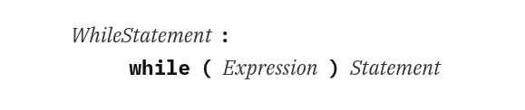
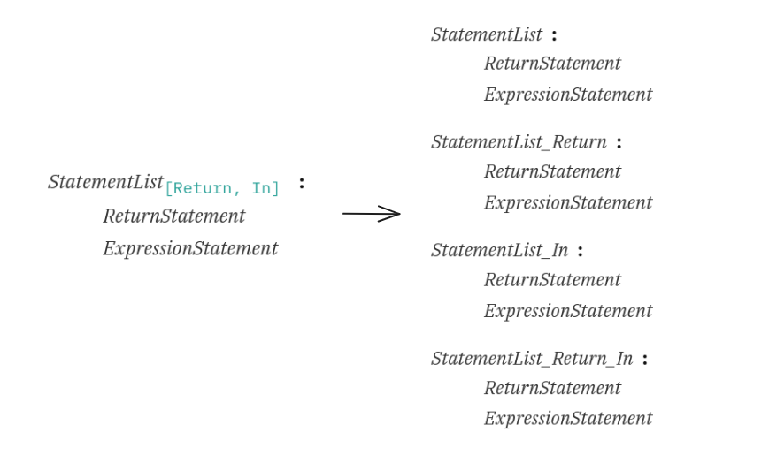
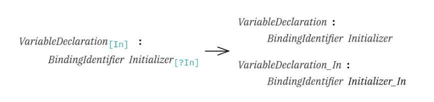

    
    

# Глава 3.1: Грамматика языка спецификации

В этой главе хотелось бы поговорить о принципах грамматики языка спецификации ECMAScript. Впервые мы
прикоснёмся к спецификации с точки зрения её исследователей, чтобы понять, как она устроена; увидим
разницу между языком спецификации и самим языком ECMAScript и сделаем соответствующие выводы. Сможем
потренироваться на картинках и научимся различать термины языка спецификации.

## Личная рекомендация

Спецификация [ECMAScript Language Specification](https://github.com/tc39/ecma262) написана на
английском языке. В ней присутствуют различные термины, без которых не получится понять базовые
принципы её устройства. В целях соблюдения семантического смысла и сохранения предельной точности
выражений **_перевод этих терминов не рекомендуется_**. В данном случае потребуется запомнить слова
такими, какими они представлены в спецификации. Например, если где-то указано слово "_production_",
рекомендуется запомнить его таким, какое оно есть - без перевода. Это касается всех терминов
спецификации. Так мы не только избежим путаниц, но и образуем свой "_словарик_" терминов, который
успешно сможем использовать в любой подходящей ситуации, например, международная конференция.

> [!WARNING]  
> **_Разбираемые дальше термины никак не относятся к языку ECMAScript (JavaScript)! Как было описано
> в предыдущей главе, мы дифференциировали 2 противоположных направления спецификации ECMAScript, и
> сейчас мы рассматриваем язык спецификации._**

## Теория языка

Как вообще можно создать язык под свои нужны? Можно придумать свой алфавит, но это будет слишком
долго, сложно и нерационально, потому что всем придётся учить ваш язык перед прочтением
составленного на нём документа. Хорошо бы на уже имеющемся языке, желательно международном,
составить нечто похожее на свой отдельный язык, где будут описаны правила, как он работает. Тут
можно провести параллель с виртуальной машиной, которая думает, что она отдельная система, но в
действительности она работает внутри уже имеющейся системы. Так вот такую "_подсистему_" и решили
описать лингвисты в виде формального языка (**_formal language_**):

> In logic, mathematics, computer science, and linguistics, a **_formal language_** consists of
> words whose letters are taken from an alphabet and are well-formed according to a specific set of
> rules called a **_formal grammar_**.
>
> ~ [wiki](https://en.wikipedia.org/wiki/Formal_language)

Как мы видим, **_formal language_** обладает набором каких-то правил, что и делает его отдельным
языком. Такие правила назвали грамматикой (**_formal grammar_**). Если изучить её теорию подробнее,
то выйдем на следующие термины:

-   [**_context-free grammar_**](https://en.wikipedia.org/wiki/Context-free_grammar)
-   [**_production rules_**](<https://en.wikipedia.org/wiki/Production_(computer_science)>)
-   [**_production_**](<https://en.wikipedia.org/wiki/Production_(computer_science)>)
-   [**_terminal_** и **_nonterminal symbols_**](https://en.wikipedia.org/wiki/Terminal_and_nonterminal_symbols)
-   [**_tokens_**](https://en.wikipedia.org/wiki/Lexical_analysis#Token)

... и много чего ещё интересного.

Если говорить обобщённо, то у нас есть какая-то своя грамматика (**_grammar_**), наподобие
**_context-free grammar_**. Эта грамматика описана правилами, называемыми **_production rules_**.
Каждое правило состоит из своего **_production_**. Сам он состоит из набора символов (**_nonterminal
symbols_**) и, где это употребимо, токенов (**_tokens_**). А этот набор, как групповое обобщение
частных, неделимых примитивов, базовых единиц, состоит из **_terminal symbols_**.

Так вышло, что спецификация написана именно в таком стиле. Решили так _инженеры_ или _люди, нанятые
писать спецификацию_, я не знаю. Можно ли было сделать представление стандарта каким-либо другим
образом, более **_лёгким и понятным_**? Очевидно, что **_да, можно_**. Но сейчас спецификация
фактически является одной из форм реализации **_formal language_**, подчиняющейся базовой
грамматике, описанной на страницах стандарта. Это ровно то, что нам и нужно понять, чтобы идти
дальше.

## Базовая грамматика

Грамматика языка спецификации устроена так, что её сложность подразумевает разбиение на несколько
подграмматик (далее просто _грамматика_). Как мы верно подметили в прошлой главе, не стоит детально
запоминать особенности всех грамматик, ведь нам нужны только основные _грамматические правила_, о
которых дальше и пойдёт речь.

Все грамматики соответствуют правилам одной общей вида
[context-free grammar](https://tc39.es/ecma262/multipage/notational-conventions.html#sec-context-free-grammars).
На её примере предлагаю рассмотреть основные
[грамматические обозначения](https://tc39.es/ecma262/multipage/notational-conventions.html#sec-grammar-notation),
которые в общем случае будут справедливы для всех грамматик. Таких обозначений достаточно много, но
для общего понимания не требуется запоминать их все. Как и в прошлой главе, определим, согласно
спецификации, ряд общих и частных, из чего состоит условное "_предложение_", но только с точки
зрения терминов стандарта, и сразу рассмотрим их на реальном примере использования грамматики:

### Пример №1

    

[На картинке](https://tc39.es/ecma262/multipage/notational-conventions.html#sec-nonterminal-symbols-and-productions)
мы видим типичное "_предложение_", но из мира спецификации. Всё это называется **_production_**. Из
таких и ещё более сложных конструкций состоит почти вся спецификация ECMAScript. На этом лёгком
примере мы можем встретить знакомый нам цикл `while` и что-то, похожее на его синтаксис. Давайте
сразу по порядку обозначим то, из чего состоит наш **_production_**.

-   **_WhileStatement_** — это **_goal symbol_**, то есть нечто, что стоит по левую сторону от
    символа "**_:_**". Одновременно с этим это ещё и **_nonterminal symbol_** (так как имеет стиль
    шрифта _italic_).
-   Символ "**_:_**" — разделяет **_production_** на две части, не имеет определения. Выполняет
    функцию идентификатора для одной из грамматик.
-   **_while_** — это **_token_**, который указывает, для какой конструкции языка ECMAScript написан
    данный production. Можно сказать, что с этой строчки вводится описание возможного синтаксиса
    (часть грамматики) языка ECMAScript, но это далеко не всегда так. Зачастую вы не увидите ничего
    схожего с синтаксисом языка JavaScript.
-   Символ "**_(_**" — это очередной **_token_**, который лекго распознать по стилю шрифта **bold**.
    Напоминает открывающуюся скобку синтаксиса объявления цикла `while` языка JavaScript.
-   **_Expression_** — это очередной **_nonterminal symbol_**, напоминающий условие работы цикла
    `while`.
-   Символ "**_)_**" — это такой же **_token_**, как и предыдущая скобка. Напоминает закрывающуюся
    скобку синтаксиса `while`.
-   **_Statement_** — это очередной **_nonterminal symbol_**, напоминающий блок кода, выполняемый
    циклом `while`.

Следом за этим примером предлагаю разобрать ещё один.

### Пример №2

    

Вот теперь на
[картинке](https://tc39.es/ecma262/multipage/notational-conventions.html#sec-optional-symbols)
похожего нет совсем ничего. Давайте коротко опишем данный **_production_**:

-   **_VariableDeclaration_** — это **_goal symbol_**, **_nonterminal symbol_**.
-   Символ "**_:_**" — это сепаратор, разделитель и идентификатор определённого вида грамматики.
-   **_BindingIdentifier_** — это **_nonterminal symbol_**.
-   **_Initializer_** — это **_nonterminal symbol_**, **_optional symbol_**
-   **_opt_** — это **_suffix_**, указывающий на опциональность, что делает рядом стоящий символ
    необязательным для **_production_**-а. Используется только лишь в качестве сокращения. То есть в
    развёрнутом виде итоговый **_production_** будет выглядеть вот так:

    

Итак, мы познакомились с базовыми грамматическими обозначениями, которые будут встречаться
повсеместно на страницах стандарта. Как и в обычном языке, в языке спецификации есть и другие
способы "_наполнить наши предложения_", но уже другими грамматическими конструкциями. Давайте
вкратце поговорим о них.

### Terminal symbols

В отличие от **_nonterminal symbol_**, который при выборе его в спецификации будет раскрыт на свои
составляющие и, возможно, представлять отдельный **_production_**, напротив, выбранный **_terminal
symbol_** - это такая же неделимая, нераскрывающаяся часть как **_token_**, зависящая от того, в
какой грамматике она используется. Например, к **_terminal symbols_** могут относиться Unicode
**_code points_**. С точки зрения **_Lexical grammar_** идентификаторы, литералы, зарезервированные
слова и пунктуационные символы, которые представляют из себя **_tocken_**-ы, тоже являются
**_termainal symbols_**.

### Parameters

Параметры или **_grammatical parameters_** - это всего лишь разновидности суффиксов (**_suffix_**) и
префиксов (**_prefix_**) для наших **_nontermanal_**-ов. Они являются частью грамматики языка
спецификации и нужны для всевозможных сокращений потенциально больших по записи **_production_**-ов,
чтобы из огромных "_предложений_" сделать такие же по смыслу небольшие "_предложения_". Мы
ограничимся лишь картинками с их разновидностью, и как они раскрываются без подробностей.

    
    
    
    

### И другие

В спецификации также введены свои дополнительные грамматичееские обозначения, которые вы сможете
увидеть в разделе
[Grammar Notation](https://tc39.es/ecma262/multipage/notational-conventions.html#sec-grammar-notation).
Среди них:

-   [**_one of_**](https://tc39.es/ecma262/multipage/notational-conventions.html#sec-one-of)
-   [**_[empty]_**](https://tc39.es/ecma262/multipage/notational-conventions.html#sec-empty)
-   [**_Lookahead Restrictions_**](https://tc39.es/ecma262/multipage/notational-conventions.html#sec-lookahead-restrictions)
-   [**_[no LineTerminator here]_**](https://tc39.es/ecma262/multipage/notational-conventions.html#sec-no-lineterminator-here)
-   [**_but not_**](https://tc39.es/ecma262/multipage/notational-conventions.html#sec-no-lineterminator-here)
-   [**_Descriptive Phrases_**](https://tc39.es/ecma262/multipage/notational-conventions.html#sec-descriptive-phrases)

## Виды грамматик

Как было описано ранее, грамматика языка спецификации ECMAScript разделена на несколько
подграмматик. Каждая из них устанавливает свои правила реализации граммматических обозначений, то
есть реализует свои требования и ограничения на то, что она подразумевает под общими терминами
**_context-free grammar_**. Например, **_terminal symbols_** в разных грамматиках определяются
по-разному. Всего на страницах спецификации по одному общему приципу реализовано 4 вида частных
грамматик:

-   [Lexical grammar](https://tc39.es/ecma262/multipage/ecmascript-language-lexical-grammar.html#sec-ecmascript-language-lexical-grammar)
-   [RegExp grammar](https://tc39.es/ecma262/multipage/notational-conventions.html#sec-lexical-and-regexp-grammars)
-   [Numeric string grammar](https://tc39.es/ecma262/multipage/notational-conventions.html#sec-numeric-string-grammar)
-   [Syntactic grammar](https://tc39.es/ecma262/multipage/notational-conventions.html#sec-syntactic-grammar)

Самым частым примером реализации грамматики является **_Syntactic grammar_**. Она определяет
различные формы реализации синтаксиса ECMAScript и его дальнейшее обслуживание внутренними
механизмами спецификации. Зачастую это некая алгоритмическая цепочка, рекурсивыные алгоритмы или
"_ранние проверки_".

Остальные грамматики пока будут пропущены на этом этапе рассмотрения темы.

## К выводу

Подведём итоге вышесказанному и сделаем выводы

-   Термины спецификации "**_не любят_**" локализации на отличный от оригинала язык.
-   Способов создать свой язык достаточно много. Одним из них является свособ представления некого
    **_formal language_** со своей **_context-free grammar_**, состоящей из **_productions_**,
    которые комбинируются с помощью **_nontermainals_**, **_termainals_** и **_tokens_**. Язык
    становится самостоятельным тогда и только тогда, когда приобретает свою неповторимую грамматику.
-   Спецификация ECMAScript наследует весь набор условного **_formal langiage_** с добавлением своих
    грамматических обозначений и расширяется благодаря комплексному подходу к инкапсулированию
    грамматик.
-   Вопрос детального описания самих грамматик пока не исследовался мною на должном уровне

~ [Глава 3.0: "Начало" языка](/get-started/Chapter_0.md.md) > Глава 3.1: Грамматика языка
спецификации > [Глава 3.2: Алгоритмы или "опять ReturnIfAbrupt"](/get-started/Chapter_2.md)
